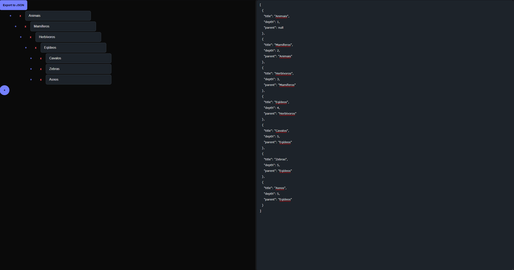

# Depth Analyzer frontend

## Getting Started

First, run the development server:

```bash
npm run dev
# or
yarn dev
# or
pnpm dev
# or
bun dev
```

Open [http://localhost:3000](http://localhost:3000) with your browser to see the page.



## How to use

- To add a new item to the tree, click on the + button
- To remove an item from the tree, click on the x button
- To download the tree as a json to use in the java depth analyzer application, click on Export to JSON
